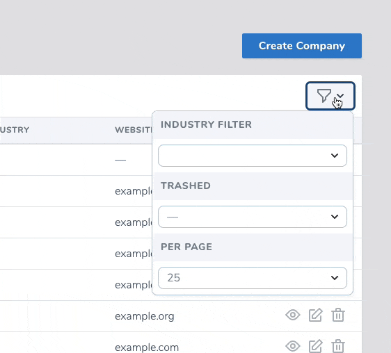

# Laravel Nova Typeahead Filter

This package provides an easy-to-setup searchable select filter for Laravel Nova resources.

## Installation

Install via composer:

```shell
$ composer require devpartners/typeahead-filter
```

## Using in Laravel Nova

After the package has been installed with Composer, simply create a new Nova filter or change an existing filter to use the typeahead-filter component. Refer to the [Nova docs](https://nova.laravel.com/docs/2.0/filters/defining-filters.html#defining-filters) for help with creating a new filter.

```php

namespace App\Nova\Filters;

use Illuminate\Http\Request;
use Laravel\Nova\Filters\Filter;

class IndustryFilter extends Filter
{
    /**
     * The filter's component.
     *
     * @var string
     */
    public $component = 'typeahead-filter';

```

Refresh your browser or navigate to your resource's index page to start using your typeahead select filter.

